# BlendView

[简体中文](README.md) | [English](README.en.md)

| 版本支持 | 5.6、5.7、5.8 |
| ---- | ----------- |

BlendView是一个 Unreal 编辑器的插件，将 Blender 风格的 G/R/S 变换、视口导航、吸附和 3D 游标等工具带入 UE，面向在 Blender 和 UE 之间切换，并希望在虚幻引擎中获得更熟悉的视口工作流程的用户。插件参考了 Blender 官方源码，最大程度的还原了在 Blender 中的原生操作手感。

## 安装

1. 下载并解压安装包，选择对应的 UE 版本。
2. 选择一种安装方式：
    - **当前项目**：将 `BlendView` 文件夹复制到 `项目目录/Plugins/`
    - **整个 UE**：将 `BlendView` 文件夹复制到 `UE安装目录/Engine/Plugins/Marketplace/`
3. 确认插件文件路径为 `BlendView/BlendView.uplugin`。
4. 在 **编辑 > 插件** 中启用 BlendView，然后重启编辑器。

## 快速开始

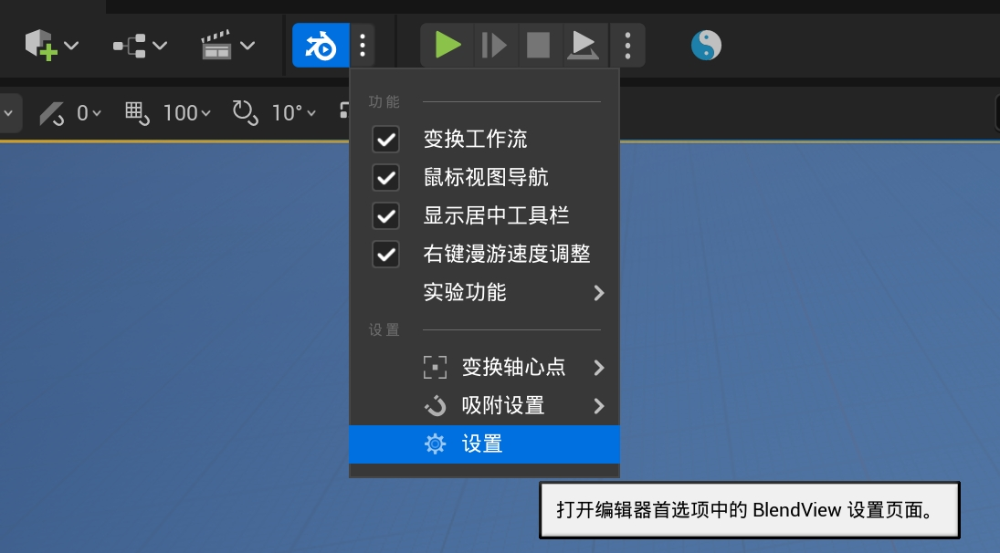

点击顶部工具栏的 BlendView 按钮可快速开启暂停插件，也可在拓展菜单中的单独开启或禁用对应的模块，点击设置可快速打开插件设置面板。

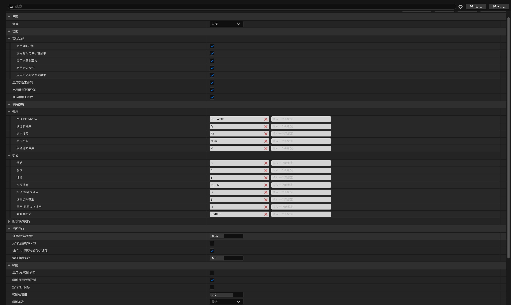

BlendView 的快捷键优先级高于原生快捷键，你可以在设置界面修改或禁用冲突的快捷键。

## 中键视口导航

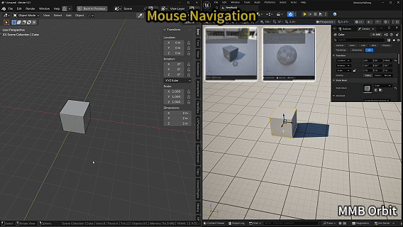

用于在 UE 场景视口中使用 Blender 风格的中键导航。

- `MMB`：环绕视图。
- `Shift + MMB`：平移视图。
- `Ctrl + MMB`：缩放视图。

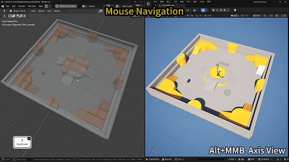

- `Alt + MMB`：对齐到最近轴向视图。
- 右键漫游过程中按住 `Shift`：加速。

## G/R/S 变换

- `G`：移动。
- `R`：旋转。
- `S`：缩放。
- `Shift + D`：复制后移动。
- `Alt + G/R/S`：重置位置 / 旋转 / 缩放。

G/R/S 将进入临时变换状态，可使用可选子命令，并提供类 Blender 风格的底部提示栏：

| 按键 | 功能 |
| --- | --- |
| `LMB`、`Enter`、`Space` | 确认 |
| `RMB`、`Esc` | 取消 |
| `Shift` | 精确模式，指针移动变慢 |
| 数字键 | 精确数值 |
| `Backspace` | 删除数字输入 |
| `X/Y/Z` | 轴向约束 |
| `X/X`、`Y/Y`、`Z/Z` | 切换全局 / 局部 |
| `Shift + X/Y/Z` | 平面约束 |
| `MMB` | 选择最近轴 |
| `Shift + MMB` | 选择最近平面 |
| `C` | 清除约束 |
| `Ctrl` | 临时吸附 |
| `B` | 重设吸附基准 |
| `O` | 编辑 Actor 枢轴点 |
| `O/O` | 进入 UE 枢轴点编辑模式 |
| `H` | 显示 / 隐藏底部提示栏 |
| `R/R` | 自由旋转 |

https://github.com/user-attachments/assets/5d278dc7-6d1b-4dd0-9dfb-ee351e36120b

- `G` 后按 `X`：沿 X 移动。
- `G` 后按 `Shift + Z`：在 XY 平面移动。
- `R` 后按 `Z`：绕 Z 旋转。
- `S` 后按 `X`：沿 X 缩放。

## 吸附

https://github.com/user-attachments/assets/9bc50e9e-3ade-4cfa-b546-4f52d196f892

吸附用于把所选物体上的源点，对齐到场景中的目标点。

- `G` 中按住 `Ctrl`：开启临时吸附。

https://github.com/user-attachments/assets/beaece9a-bd59-4de7-9a50-a67f5bde335f

- `B`：重设吸附基准。

## 居中工具栏

顶部工具栏提供吸附菜单和变换轴心点的快捷设置。

### 吸附设置

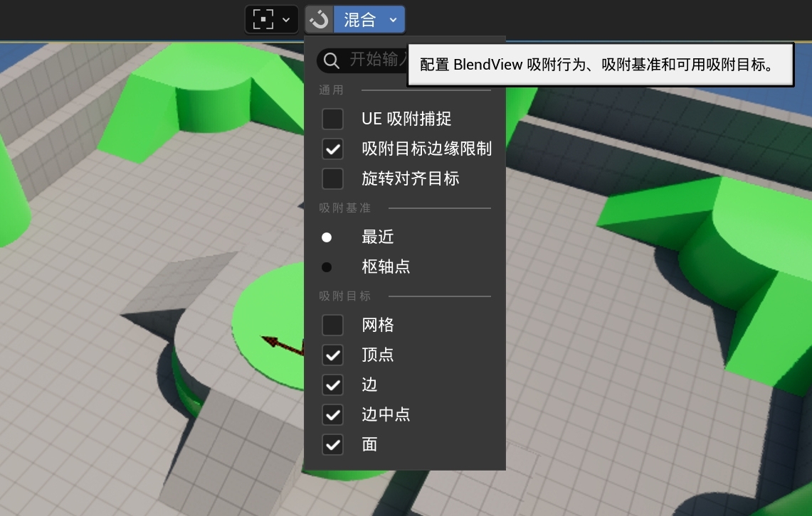

**通用：**

- **UE 吸附捕捉**：使用 UE 原生吸附捕捉辅助 BlendView 吸附。
- **吸附目标边缘限制**：优先识别结构性边缘，将忽略不对结构产生影响的点线。
- **旋转对齐目标**：吸附到面或目标方向时，同时让物体旋转对齐目标。

**吸附基准：**

- **最近**：以所选物体上最接近吸附目标的位置作为吸附基准。
- **枢轴点**：以物体枢轴点作为吸附基准。

**吸附目标：**

- **网格**：允许吸附到视口网格。
- **顶点**：允许吸附到模型顶点。
- **边**：允许吸附到模型边线。
- **边中点**：允许吸附到边线的中点。
- **面**：允许吸附到模型表面。

### 变换轴心点

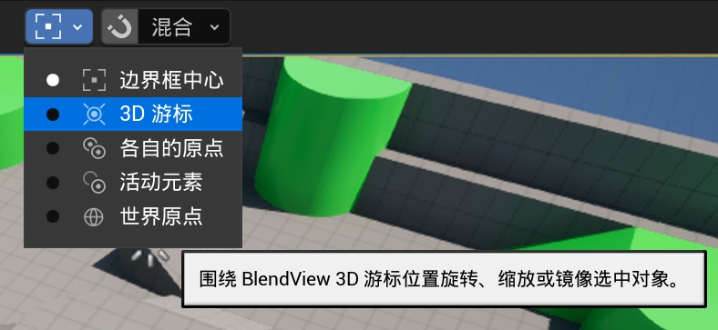

- **边界框中心**：以所选物体整体包围盒的中心作为旋转和缩放中心。
- **3D 游标**：以 3D 游标位置作为变换中心。
- **各自的原点**：每个选中物体都围绕自己的原点独立旋转或缩放。
- **活动元素**：以最后选中的活动项枢轴点作为变换中心。
- **世界原点**：以世界坐标原点 `(0, 0, 0)` 作为变换中心。

## 图表编辑

https://github.com/user-attachments/assets/e2dcbc3d-54f7-46bd-9d1a-647b463f2c50

图表工具把同样的模态操作习惯带到蓝图、材质和其他受支持的 GraphEditor 面板。

- `G/R/S`：移动 / 旋转 / 缩放图表节点。
- `X/Y`：图表约束。
- `Ctrl`：支持时启用图表吸附。

https://github.com/user-attachments/assets/e399a782-94f8-4d68-9e93-2c3a7a6dce6d

- `Ctrl + Shift + LMB`：预览材质节点。
- `Ctrl + X`：支持时删除并重连。
- `Shift + D`：复制并移动。

## 实验功能

一些仍在测试中的功能，但可能只适用于特定编辑器上下文。

### 游标

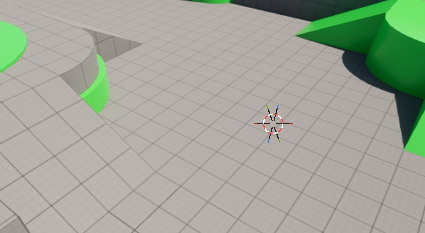

- `Shift + RMB`：放置游标。

类 Blender 的游标功能：3D 游标是一个可放置在场景中的临时参考点，它同时保存位置和旋转方向，可用于指定变换中心、移动物体目标位置、放置物体原点，或作为后续对齐与编辑操作的空间基准。

### 游标和原点饼菜单

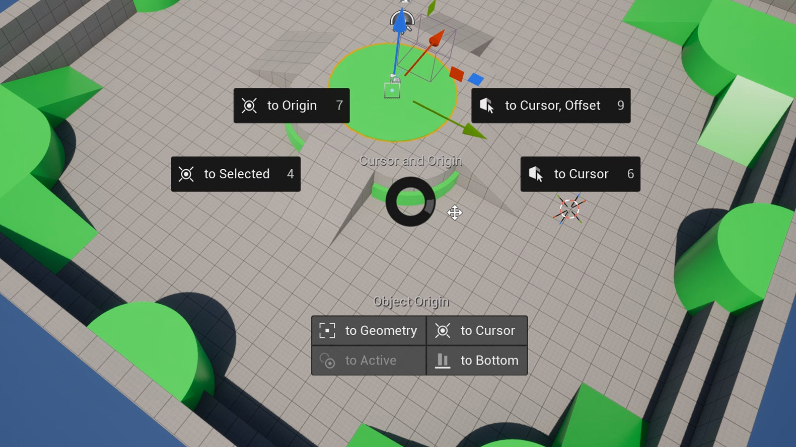

`Shift + S`  用于定位 3D 游标、移动所选物体到游标，或调整物体原点。

**游标与原点：**

- **到原点**：将游标移动到原点，并重置游标旋转。
- **到所选**：将游标移动到当前所选；多选时移动到所选的整体中心。
- **到游标，偏移**：将所选整体移动到游标，保持物体间相对偏移。
- **到游标**：将所选移动到游标，并使用游标的旋转方向对齐。

**物体原点：**

- **到几何中心**：将 Actor 枢轴点移动到自身几何中心。
- **到游标**：将 Actor 枢轴点移动到游标。
- **到活动**：将 Actor 枢轴点移动到活动项（末选项）枢轴点。
- **到底部**：将 Actor 枢轴点移动到物体底部中心。

### 搜索

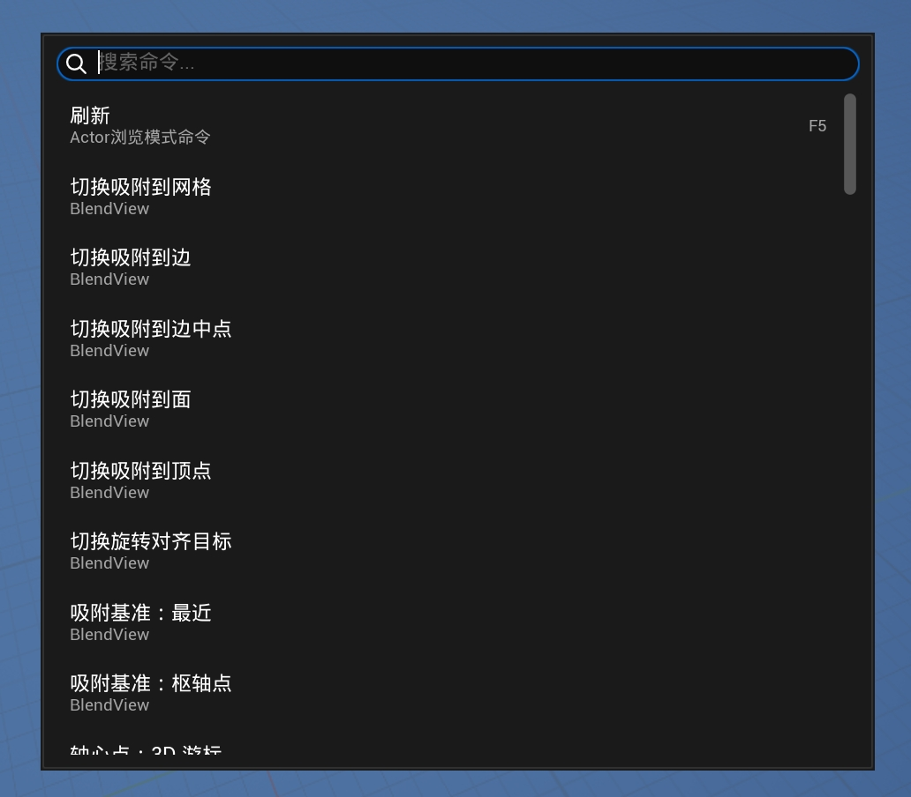

 `F3`：搜索

类 Blender 的 `F3` 命令搜索。输入关键词即可查找当前上下文可用的命令，左键点击直接执行。右键点击命令可添加到 `Q` 快速收藏夹；支持快捷键的命令也可以在这里设置或修改快捷键。

### 快速收藏夹

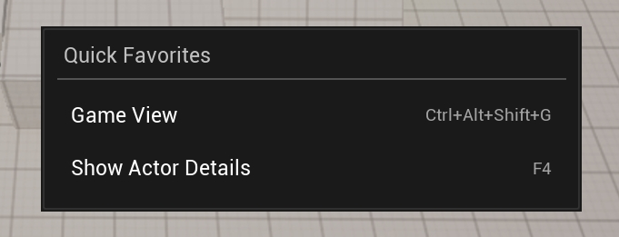

- `Q`：打开收藏夹。

类 Blender 的 `Q` 快速收藏夹，用于保存常用命令。按 `Q` 打开菜单，左键点击即可执行收藏的命令。命令可通过 `F3` 搜索菜单添加，或在右键菜单中移除。

### 移动到文件夹

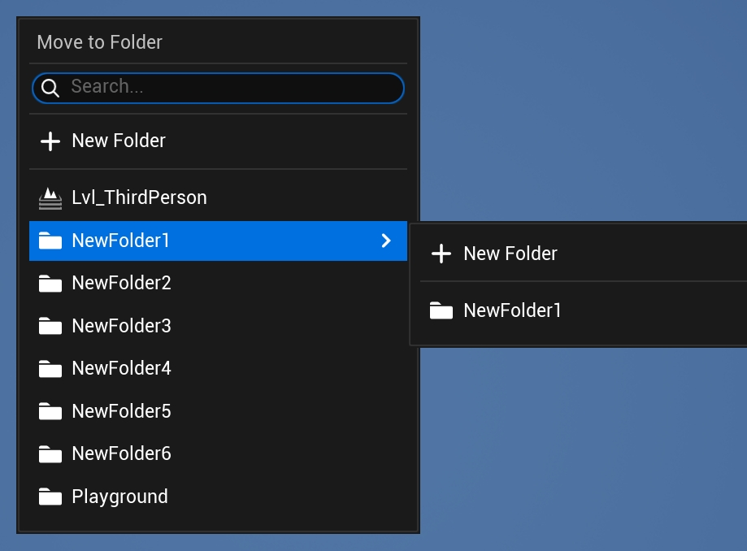

- `M`：打开快速移动菜单。

类 Blender 的 `M` 快速移动菜单，用于将当前选中的 Actor 移动到其他文件夹。
